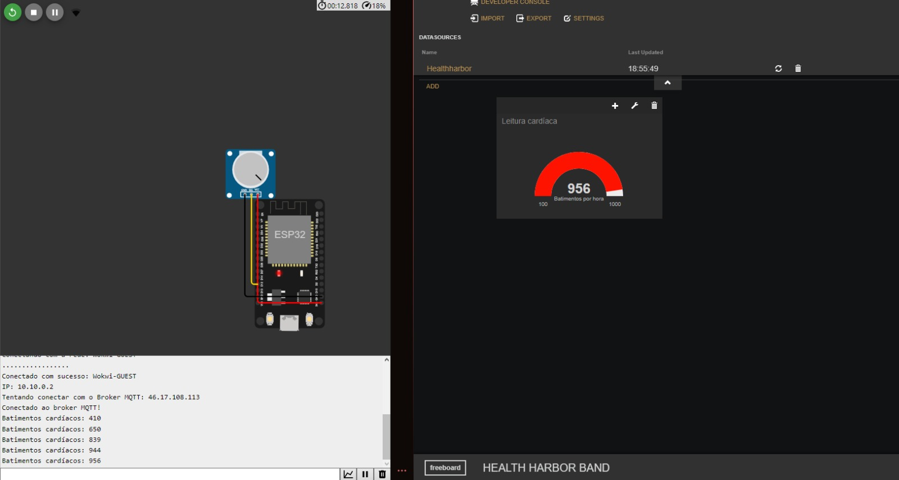

# HealthHarbor Band

    Conectando Seu Bem-Estar

## Detalhes do Produto:
O produto "HealthHarbor Band" é um pulseira, com a finalidade de identificar possíveis sintomas da "síndrome de burnout", caso não saiba o que seria, é um problema emocional com sintomas de cansaço extremo, estresse e exaustão física. Geralmente surge de trabalhos intensos, cheios de competição ou muita responsabilidade. O principal motivo desse problema é, na verdade, trabalhar demais. É algo que acontece bastante com pessoas que lidam diariamente com pressão e responsabilidades, como médicos, enfermeiros, professores, policiais, jornalistas e outros profissionais. Está solução nos auxiliará a identificar sintomas dessa doença, para que tenham o devido tratamento do problema. Sendo suas leituras principais um baixo rendimento no trabalho, aceleração cardíaca e pressão alta da pessoa que estiver utilizando. (Os dados lidos não necessariamente indicam que a pessoa possui tal síndrome, ainda seria necessário a avaliação de um psicólogo especialista, contudo são índicios de sintomas recorrentes).

Dados coletados pela pulseira serão enviadas através do fiware para um "freeboard", onde poderá ser feita a observação se a pessoa está com dados alarmantes, já que aumento de pressão, aceleração cardíaca podem acarretar até em parada cardíaca. Sem contar do mal que faz para a saúde mental das pessoas, se sentirem incapazes, não renderem nada no trabalho. Por este e outros motivos a HealthHarbor Band procura a identificação rápida do "burnout", para terem o devido tratamento o quanto antes possível, mantendo tanto a saúde física quanto emntal da melhor forma possível.

## Objetivo do produto:
É buscado que seja possível para todos que chegam ao limite de exaustão. O tratamento inclui acompanhamento psicológico, momentos de lazer e relaxamento e outros métodos, sem contar que em casos mais extremos é possível ser necessário a receita de antidepressivos. A duração do tratamento é relativa, com a possibilidade de durar anos. Em alguns casos, o colaborador precisa se afastar completamente do trabalho. Entretanto, é possível se cuidar sem precisar se licenciar. Por isto a HealthHarbor Band busca tratar o quanto antes possível, evitando que leve a problemas maiores.

## Componentes:

Os componentes principais do primeiro protótipo incluem um ESP-32 para se conectar ao FIWARE e transportar os dados lidos à uma plataforma "freeboard". Fazendo com que assim os dados possam ser ldios de forma remota. Um sensor de frequência cardíaca, para que assim seja lido as alterações na pessoa que a estiver utilizando.

O ESP-32 estará conectado no sensor de frequência cardíaca para que a leitura seja feita, e em seguida seja transmitida a leitura em um tempo quase que real para a área de Front-End, para que os dados sejam avalíados e recebam os devidos alertas.

### Imagem da simulação no Wokwi:
(UTILIZADO O POTENCIÔMETRO PELO SITE NÃO TER O SENSOR NECESSÁRIO PARA A DEVIDA APLICAÇÃO)

## Montagem do porótipo:

- Placa ESP-32;
- Sensor de frequência cardíaca;
- LED(Ligarem demonstrando se necessita estar em alerta);
- Buzzer (Acionar quando o nível de leitura estiver crítico, muito fora do comum);
- Conexão com a internet.

## Integrante:
Murilo Marsola Eloys (rm: 552117)
